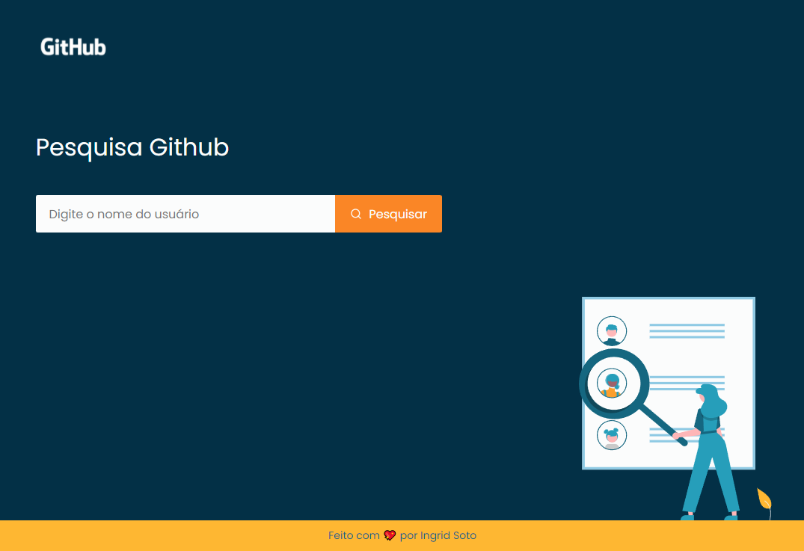

<h1 align="center">api-github-repositories</h1>

<p align="center">
  
</p>

##### [Link da Aplicação](https://api-github-repositories.vercel.app/)

# 💻 Projeto
API de pesquisa de usuários do GitHub.

# 🚀 Techs
* React
* React-DOM
* React-Toastify
* Styled-Components
* Typescript
* Axios
* Vite

# 🎨 Style

#### Cores:

```css
:root {
  --bg-blue: #023047;
  --blue-light: #8ECAE6;
  --blue: #219EBC;
  --blue-dark: #126782;
  --yellow: #FFB703;
  --orange: #FB8500;
  --light: #FBFCFC;
}
```

#### Tipo de fonte:
font-family: Poppins
font-weight: 300, 400, 500 e 700
Você pode encontrar a fonte no [Google Fonts](https://fonts.google.com/)

